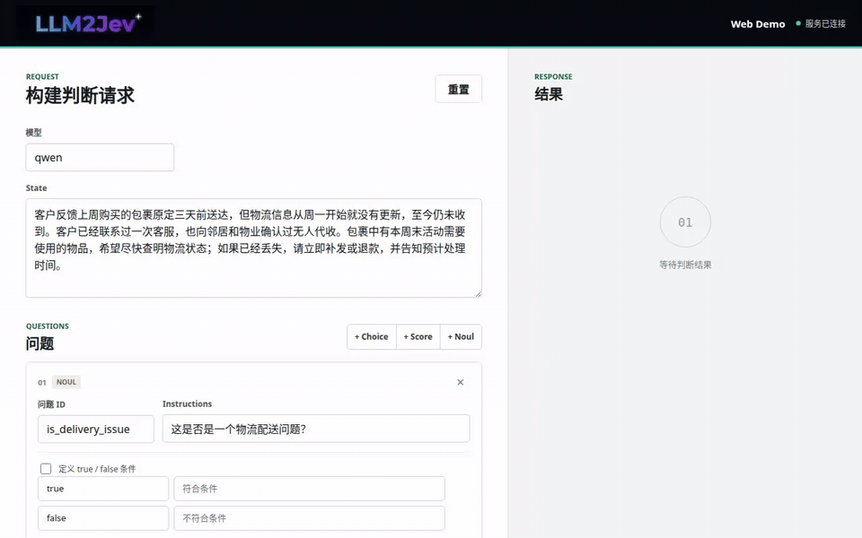
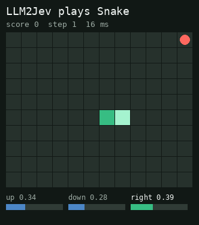

  <p align="center">
    
  </p>

<div align="center">

# LLM2Jev: Turn LLMs into Jev-Style Decision Models
<br/>

[](pyproject.toml)
[](LICENSE)
[](docs/usage.md)

[简体中文](README_zh.md)

**LLM2Jev adapts local language models to Jev-style structured decisions. It accepts runtime-defined `Choice`, `Score`, and `Noul` questions and returns typed answers with probabilities.**

</div>

> LLM2Jev is an independent open-source project. It is not affiliated with or endorsed by Jev or TypeSafe.


## Key Features

- **Structured decisions:** define `Choice`, `Score`, and `Noul` questions at runtime. Get option probabilities, weighted scores, or the probability that a condition is true.
- **Probabilities from logits:** score each candidate with an independent yes/no judgment, then assemble JSON in code. No answer tokens are generated.
- **Order-independent options:** evaluate each Choice candidate independently, so reordering options does not introduce a positional preference or change their scores.
- **Shared-prefix caching:** stage candidate submissions to reuse SGLang's Radix Cache within a single request, including a first request with no relevant cached prefix.

Candidates share `state`, and candidates for the same question also share its `instructions`. LLM2Jev first scores a real `criteria` candidate to establish the prefix cache, then submits candidates that can reuse it. Each candidate is scored once, reducing repeated computation for long inputs with many candidates.


Learn how it works: [From Jev Request to LLM Request](docs/request-to-model.md) → [Shared-prefix design](docs/shared-prefix-cache.md).

## News

- **September 21** - **[Web and Snake demos](#demos):** added interactive examples for composing mixed questions and model-driven decisions.
- **September 21** - **Shared-prefix reuse:** added staged candidate submission for reusing SGLang's Radix Cache, with [architecture](docs/request-to-model.md), [usage](docs/shared-prefix-cache.md), and [benchmark](docs/shared-prefix-benchmarks.md) documentation.
- **September 20** - **SGLang and System One API:** added the SGLang scoring backend and a compatible [`POST /v1/systemone`](docs/usage.md#system-one-http-api) endpoint.


## Quick Start

On Linux with a supported NVIDIA GPU, run a local model through SGLang:

```bash
git clone https://github.com/Yinsongxu/LLM2Jev.git
cd LLM2Jev
uv sync --extra sglang
source .venv/bin/activate
python examples/sglang_inference.py --model-path /path/to/model
```

The example submits Choice, Score, and Noul questions and prints the response as JSON.
Replace `/path/to/model` with a local Hugging Face-compatible causal language model directory.

## Installation

See [Installation](docs/installation.md) for environment requirements, SGLang and Transformers dependencies, and uv or pip installation.

## Getting Started

See the [Usage guide](docs/usage.md) for complete examples:

- [SGLang Python API](docs/usage.md#sglang-python-api)
- [Transformers backend](docs/usage.md#transformers-backend)
- [System One HTTP API](docs/usage.md#system-one-http-api)
- [Choosing between `staged` and `all`](docs/usage.md#choosing-a-mode)

## Demos

<table>
  <tr>
    <td align="center" valign="middle" width="67%"></td>
    <td align="center" valign="middle" width="33%"></td>
  </tr>
  <tr>
    <td align="center"><a href="demos/web/README.md"><strong>Web demo</strong></a></td>
    <td align="center"><a href="demos/snake.py"><strong>Snake demo</strong></a></td>
  </tr>
</table>


## Benchmarks

See [Performance benchmarks](docs/shared-prefix-benchmarks.md) for the Qwen3-1.7B / RTX 5090 measurements, test conditions, and comparison of `staged` and `all` across cold and warm caches. Gains depend on input length, candidate count, and cache state.

## Roadmap

- [ ] More benchmarks across model sizes, datasets, and workloads, covering decision quality, latency, and throughput.
- [x] An interactive web demo for submitting questions and inspecting probabilities.
- [ ] Multimodal model and input support.
- [ ] More multimodal tasks and demos.

## Tests

```bash
python -m unittest discover -s tests -v
```

## License

This project is licensed under the [Apache License 2.0](LICENSE).
