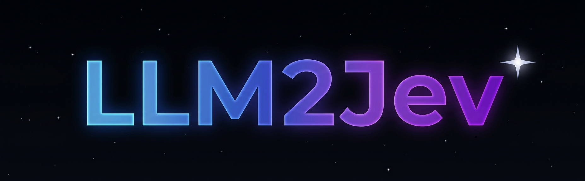
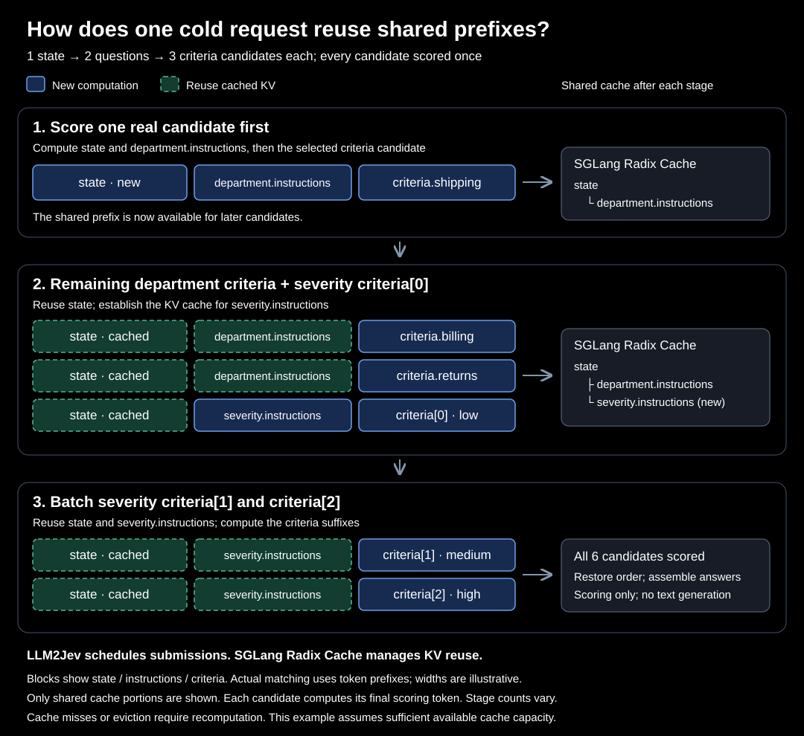

  <p align="center">
    
  </p>

# LLM2Jev：将 LLM 转换为 Jev 风格的决策模型

[English](README.md)

LLM2Jev 将本地语言模型适配为 Jev 风格的结构化决策模型。它接受运行时定义的 `Choice`、`Score` 和 `Noul` 问题，并返回包含概率的类型化答案。

> LLM2Jev 是一个独立的开源项目，与 Jev 或 TypeSafe 没有关联，也未获得其认可或授权。

## 快速开始

在配有受支持 NVIDIA GPU 的 Linux 环境中，使用 SGLang 运行本地模型：

```bash
git clone https://github.com/Yinsongxu/LLM2Jev.git
cd LLM2Jev
uv sync --extra sglang
source .venv/bin/activate
python examples/sglang_inference.py --model-path /path/to/model
```

示例会提交 Choice、Score 和 Noul 三种问题，并将响应输出为 JSON。
请将 `/path/to/model` 替换为本地 Hugging Face 兼容的因果语言模型目录。

## 核心特性

- **结构化判断**：运行时定义 `Choice`、`Score` 和 `Noul` 问题，获得选项概率、加权分数或条件成立的概率；Choice 和 Score 还包含 confidence。
- **从 logits 计算概率**：对每个候选进行独立的 yes/no 判断，由代码组装 JSON，无需 LLM 逐 token 生成回答。
- **共享前缀缓存**：通过分阶段提交，在单次请求内复用 SGLang 的 Radix Cache，首次请求没有相关历史缓存时也能利用共享前缀。

所有候选共享 `state`，同一道题的候选还共享 `instructions`。LLM2Jev 先评分一个真实的 `criteria` 候选来建立前缀缓存，再提交能够复用它的其他候选。每个候选只评分一次，减少长输入、多候选场景中的重复计算。



了解工作原理：[从 Jev Request 到 LLM Request](docs/request-to-model_zh.md) → [共享前缀设计](docs/shared-prefix-cache_zh.md)。

## 安装

环境要求、SGLang 与 Transformers 依赖，以及 uv、pip 安装方式见[安装指南](docs/installation_zh.md)。

## 使用入门

完整示例见[使用指南](docs/usage_zh.md)：

- [SGLang Python API](docs/usage_zh.md#sglang-python-api)
- [Transformers 后端](docs/usage_zh.md#transformers-后端)
- [System One HTTP API](docs/usage_zh.md#system-one-http-api)
- [`staged` 与 `all` 的选择](docs/usage_zh.md#哪种方式更适合我的请求)


## Benchmarks

[性能测评](docs/shared-prefix-benchmarks_zh.md)记录了 Qwen3-1.7B / RTX 5090 的测试条件、实测数据，以及冷缓存和热缓存下 `staged` 与 `all` 的比较。收益取决于输入长度、候选数量和缓存状态。

## Roadmap

- [ ] 更多 benchmark：覆盖不同模型规模、数据集和工作负载，评估判断质量、延迟与吞吐量。
- [ ] 网页 demo：交互式提交问题并查看概率结果。
- [ ] 支持多模态模型与输入。
- [ ] 更多多模态任务及 demo。

## 测试

```bash
python -m unittest discover -s tests -v
```

## 许可证

本项目基于 [Apache License 2.0](LICENSE) 发布。
